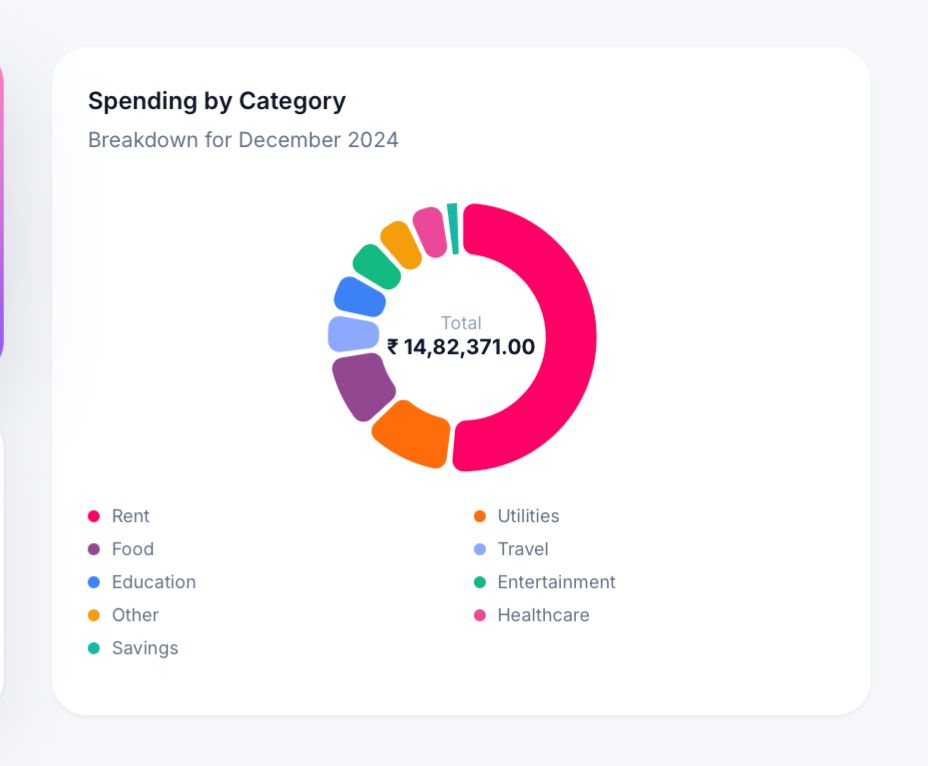

# FinFusion 💸

FinFusion is a full-stack personal finance intelligence platform built to help users track expenses, understand spending behavior, and explore predictive insights through an interactive dashboard. The project combines modern frontend design with backend analytics, machine learning-based forecasting, and OCR-assisted expense entry to create a more intelligent expense management experience.

## Project Overview

The core goal of FinFusion is to move beyond simple expense logging and into explainable financial analysis. Instead of showing only raw transaction lists, the application turns user data into dashboards, category analytics, forecast simulations, and insight panels that help users understand how and where they spend.

The system is designed around three ideas:

- expense tracking with persistent user accounts
- intelligent analytics generated from transaction history
- decision-support UI powered by forecasting and receipt OCR

## Key Features

### Login
- Secure user authentication system
- Demo account access for quick testing
- Separate environments for preloaded and manual data usage

  

### Expense Management

- Add, edit, and delete personal expenses
- Separate demo and user-entered data modes
- Categorized transaction history across food, rent, utilities, travel, healthcare, and more

  
  

### Dashboard Analytics
- Monthly spending summaries
- Category breakdowns and budget tracking
- Recent expense activity
- Data-driven insight cards generated from historical behavior

  

### Forecasting
- LSTM-based time-series forecasting for future spending projection
- Recursive multi-day prediction pipeline
- Forecast trend detection, peak day estimation, and confidence scoring
- Explainable forecast UI with projected totals, category pressure, and context panels

  

### Receipt Scanning with OCR
- Upload receipt images directly from the dashboard
- OCR extraction of total amount, category, and spending description
- Editable verification step before final submission
- Manual fallback when OCR confidence is low or extraction fails

  

### Historical Insights
- Monthly trend visualization
- Category trend comparison over time
- Top-spending category ranking
- Month-over-month analysis for spending changes

  

## Machine Learning and Intelligence Layer

FinFusion includes an LSTM-based forecasting pipeline that uses historical spending sequences to simulate likely future spending behavior. The model is designed to learn temporal patterns from transaction history, such as recurring spikes, day-based rhythm, and broader spending drift.

The forecasting pipeline includes:

- feature engineering from daily spending history
- rolling averages and temporal context features
- recursive 30-day prediction
- post-processing for stability and realistic outputs
- backend-generated forecast insights for frontend visualization

The application also includes a rule-based insight layer that transforms computed metrics into readable observations, such as trend direction, category pressure, and liquidity alerts.

## OCR Pipeline

The receipt scanning flow uses OCR to extract text from uploaded receipts and then parse the content to identify:

- total payable amount
- transaction date
- likely category
- merchant or item description

This information is passed back to the frontend, where the user can verify and edit the extracted fields before saving the expense. This keeps the workflow practical and user-safe, especially when OCR is imperfect.

## Tech Stack

### Frontend

- React
- CRACO
- Tailwind CSS
- Recharts
- Radix UI components

### Backend

- FastAPI
- SQLAlchemy
- SQLite
- Pandas and NumPy for analytics processing

### Machine Learning / Data

- TensorFlow / Keras for LSTM forecasting
- scikit-learn for preprocessing and supporting utilities
- pytesseract for OCR-based receipt parsing

## Application Architecture

FinFusion follows a split frontend-backend architecture:

- the frontend is responsible for authentication flow, dashboards, charts, and user interaction
- the backend is responsible for persistence, filtering, analytics, forecasting, and OCR parsing

The platform is organized so that business logic lives on the backend and the frontend consumes structured API responses for rendering. This keeps analytics and predictive behavior centralized and easier to extend.

## Demo Accounts

Two demo modes are included for presentation and evaluation:

- `demo@example.com` / `demo123`
  Preloaded with historical dataset-backed spending data

- `demo2@example.com` / `demo123`
  Empty account intended for live manual entry demos

## Deployment

The project is configured for public deployment using:

- Vercel for the frontend
- Render for the backend

The backend Docker configuration includes OCR system dependencies so receipt scanning can work in production. The application also supports hosted database configuration through environment variables when moving beyond local SQLite storage.

## Purpose 📌

FinFusion was built as an academic full-stack intelligent finance project that demonstrates how traditional expense tracking can be extended with:

- machine learning
- OCR
- interactive analytics
- explainable ai driven financial insights

Rather than positioning itself as a production-grade financial advisory system, the project is intended as a practical demonstration of intelligent personal finance tooling with a strong focus on usability, interpretability, and end-to-end system design.

Thank you for stopping by 💕
